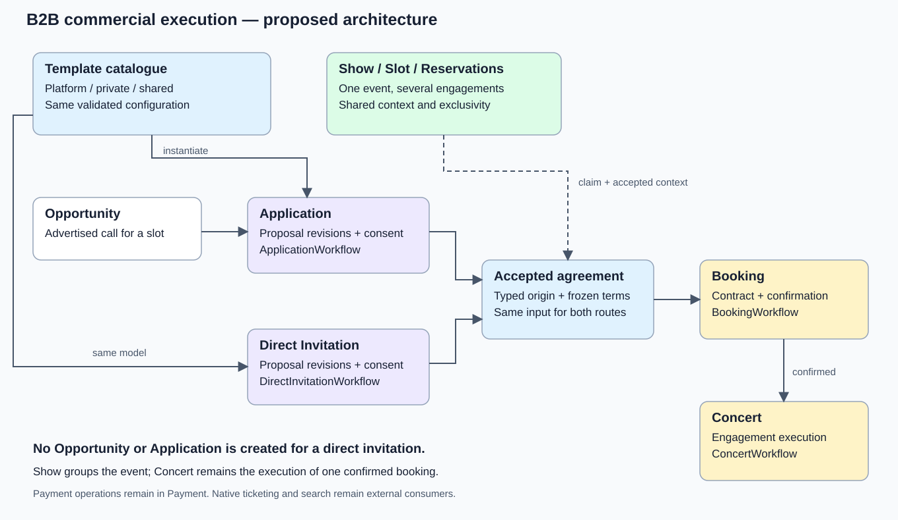
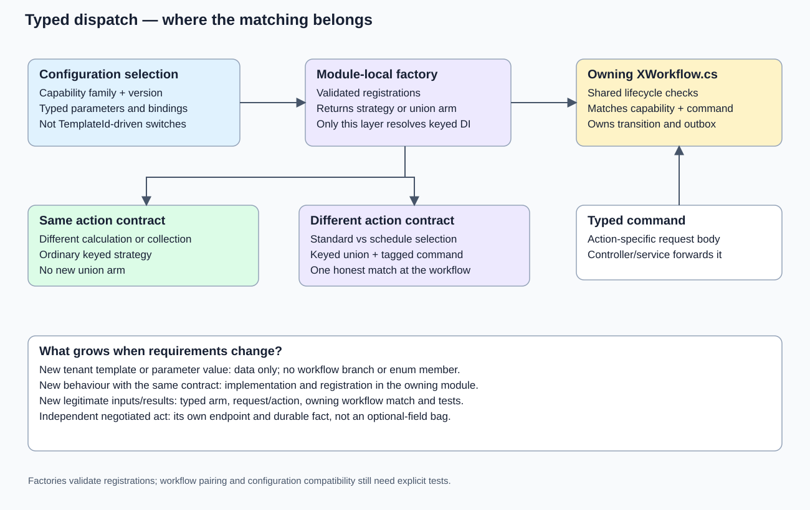
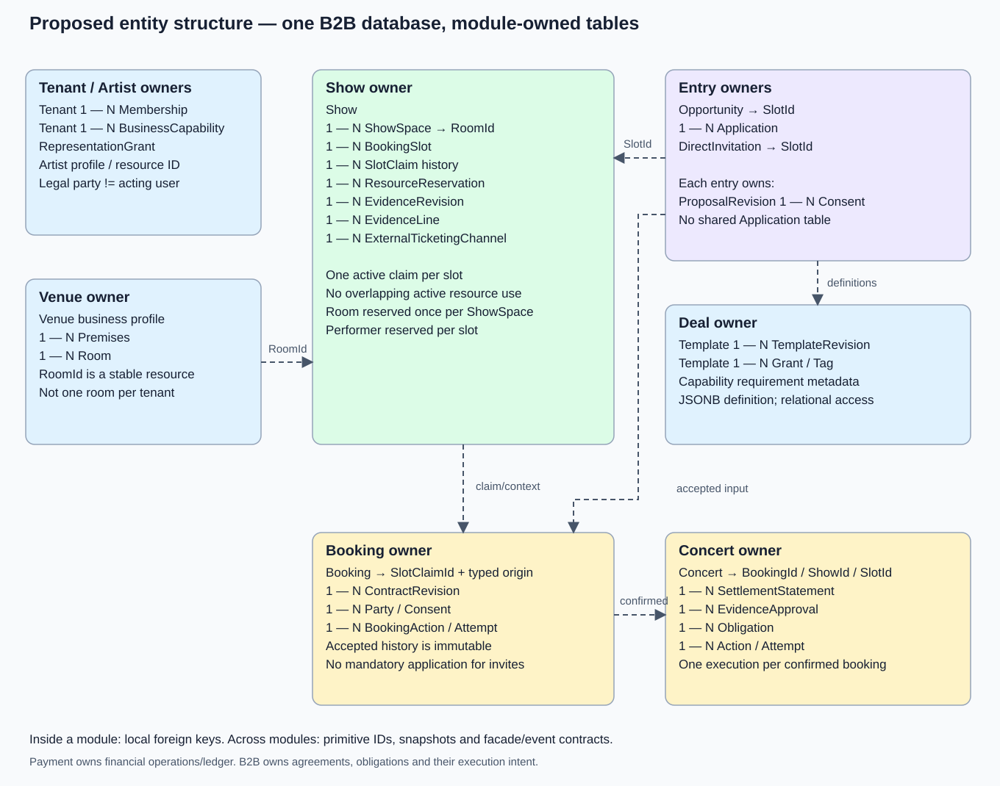

# B2B commercial execution: architecture and coordinated delivery plan

Status: **discussion-refined architecture draft, updated 8 September 2026; application implementation and database migration are not authorised.**

This is the B2B-owned successor to the direct-offers draft, not a second plan running alongside it.
It covers B2B commercial configuration, templates, both booking entry paths, event/resource context and
the B2B PostgreSQL migration. Shared-package changes and foreign contract consumers are dependencies.
It does not own Payment, Customer, Search or Auth implementation or provider migrations.

Next action: [the progress ledger](COMMERCIAL_EXECUTION_PROGRESS.md#next-steps).

For the latest discussion, start with the [configuration and entity sketches](#keep-lifecycle-sections-make-their-connections-explicit),
[factory and capability matching](#matching-belongs-in-the-owning-workflow),
[operation catalogue and Application flow](#the-operation-catalogue-and-owned-facts), and
[existing-code migration map](#source-to-target-migration-of-existing-responsibilities).

## Read this first

The preferred design is a hybrid template catalogue producing one versioned commercial configuration.
Application and Direct Invitation negotiate that configuration independently and hand one accepted
agreement shape to Booking. Each lifecycle retains its own orchestration and typed capability matching.
Show groups the event and its engagements; it does not replace PR633's per-booking Concert lifecycle.

**A new template is usually data. A new capability implementation is code. A new legitimate action
contract may earn a keyed-union arm. These are three different kinds of change.**

The entity names and contracts below are proposed target names, not claims that they already exist.
"Agreed" means explicitly established in the conversation or current product decisions. "Recommended"
means the design proposed here. Sections marked "Decision" must not be treated as approved by merely
reading this plan.

### Contents

1. [Authority, baseline and established constraints](#1-authority-baseline-and-established-constraints)
2. [The architecture at a glance](#2-the-architecture-at-a-glance)
3. [Configurations, templates and capability identities](#3-configurations-templates-and-capability-identities)
4. [Where keyed strategies and keyed unions earn their place](#4-where-keyed-strategies-and-keyed-unions-earn-their-place)
5. [Proposed entities and database ownership](#5-proposed-entities-and-database-ownership)
6. [Acceptance, reservations and the common Booking input](#6-acceptance-reservations-and-the-common-booking-input)
7. [Catalogue ownership, authoring and execution efficiency](#7-catalogue-ownership-authoring-and-execution-efficiency)
8. [Validity, amendments and recovery](#8-validity-amendments-and-recovery)
9. [Financial scenarios and missing capabilities](#9-financial-scenarios-and-missing-capabilities)
10. [B2B PostgreSQL migration](#10-b2b-postgresql-migration)
11. [Contracts, consumers and service boundaries](#11-contracts-consumers-and-service-boundaries)
12. [Coherent delivery slices](#12-coherent-delivery-slices)
13. [Verification and observable completion](#13-verification-and-observable-completion)
14. [Decisions for review](#14-decisions-for-review)
15. [Evidence and existing-owner reconciliation](#15-evidence-and-existing-owner-reconciliation)

## 1. Authority, baseline and established constraints

### Source authority

The implementation baseline is the monorepo's merged B2B source, not the older extracted B2B checkout:

| Evidence | Inspected identity | Consequence |
|---|---|---|
| PR633 | Merge 516f4cc25936289744babef3f98b1a297035fbb6 | Opportunity/Application/Booking/Concert ownership is established, not work to reinvent |
| Initial investigation baseline | ed5c0fce602fc6a2e9aaa65cfe74970c51dc7c90 | Includes subsequent Application contract packaging and confirmed-term polymorphic serialization |
| Authoring refresh | f72431d7b6800b72f855706cd7fa1469681406de | PR947 adds owner-local migration/setup tooling; no lifecycle runtime change relative to the investigation baseline |
| Discussion refresh | 3826320d1cd171705dffe1a74340e62b9a1e14c2 | Later host/package/CI changes inspected; Application/Booking/Concert/Deal runtime source remains unchanged from the authoring refresh |
| Extracted Concertable/b2b main | fded052cdbf6f0f4c8f55ef7414c13ffc19ab33c | Still older than PR633's lifecycle split; not the source to design against |
| Concertable/docs main | 99ad353b9cb26921ad8914e0f1449202574e330e | Includes docs PR11; no newer remote docs found during authoring |
| Organiser research, not merged policy | Docs/Organiser-Commercial-Research at 5ac4048a6f4145f1e8f22d1e043aff33da47ba3f | Sixteen scenarios and five worked arrangements inform the design; demand, funding permissions and disputed-outcome authority remain unproven |

The plan lives inside the authoritative B2B subtree so it travels with B2B when extraction is qualified.
Before every delivery slice, re-resolve which repository/branch owns its current source and published
contracts. This plan is not permission to overwrite the retained B2B repository with an older snapshot.

### Established direction

- Opportunity -> Application -> Booking -> Concert.
- Direct Invitation -> Booking -> Concert.
- Applications and invitations own their acceptance/counteroffer histories. No synthetic Opportunity
  or Application is created to support an invitation.
- Stages own workflows when they have orchestration to perform. Behavioural variation selects reusable
  capabilities; genuinely different contracts use discriminated types.
- Configurable commercial execution is the selected direction. B2B comes first; external ticketing
  remains a workable route. Future discovery/native ticketing is not discarded.
- Mixing and matching semantically compatible capabilities is the objective, including within an
  operation. Restrictions must describe real dependencies, not recreate whole-deal preset bundles.
- One coordinated architecture may require multiple coherent PRs and producer/consumer gates.
- The provider migration in this plan is B2B-only, including required shared-library compatibility.
- Planning is authorised. Application changes, migration execution, deployment and data destruction are not.

Durable product ownership remains in [SYSTEM](https://github.com/Concertable/docs/blob/main/SYSTEM.md),
[configurable workflows](https://github.com/Concertable/docs/blob/main/product/CONFIGURABLE_DEAL_WORKFLOWS.md),
[booking and settlement](https://github.com/Concertable/docs/blob/main/product/BOOKING_AND_SETTLEMENT.md)
and [accounts and operations](https://github.com/Concertable/docs/blob/main/product/ACCOUNTS_AND_OPERATIONS.md).
This plan applies those decisions to B2B; it is not a replacement product specification.

## 2. The architecture at a glance

The diagram's central relationship is:

~~~text
                              Show
                     /          |          \
                 venue hire  headliner    support
                     |          |          |
                  BookingSlot / resource claims
                     ^                     ^
                     |                     |
               Opportunity          Direct Invitation
                     |
                Application
                     \                     /
                       accepted agreement
                               |
                            Booking
                               |
                            Concert
~~~

This is a relationship diagram, not an additional mandatory linear lifecycle.
A person starting with "invite an artist" can create the real Show/Slot context in the same interaction;
there is no need to force them through a separate show-planning wizard.

### Ownership inside B2B

| Owner | Target responsibility |
|---|---|
| Tenant | Legal business, memberships, business capabilities, explicit representation grants and configurable defaults |
| Venue | Venue business profile, premises and rooms |
| Artist | Artist/performer profile and its stable resource identity |
| Show, new module | Show, assigned spaces, booking slots, slot claims, resource reservations and shared revenue/cost evidence |
| Opportunity | Advertised call for one slot, eligibility, visibility and open/filled/withdrawn lifecycle |
| Application | Artist-originated negotiation and consent for an opportunity |
| DirectInvitation, new module | Addressed negotiation and consent without an opportunity/application |
| Deal | Template catalogue, definition revisions, configuration vocabulary and validation of supported composition |
| Booking | Accepted origin and contract revisions; confirmation/cancellation before handoff; booking-stage actions |
| Concert | Operational execution after confirmation, completion/cancellation, settlement and concert-stage actions |

"Deal" continues to mean commercial terms/configuration, not the owner of every lifecycle.
Runtime factories and implementations remain in the module executing the action. A central catalogue may
describe supported capabilities; it must not become a cross-module service locator.

Concert remains the execution of one confirmed commercial engagement. A Show can group several Concerts.
Venue hire must not invent an artist account to fit the old pair of columns. The target execution has a
typed subject (performance or venue hire), explicit parties and supply direction. Whether the user-facing
word for a non-performance Concert should be "engagement" is an open naming decision, not a reason to
move PR633's orchestration back into Deal or Show.

## 3. Configurations, templates and capability identities

| Concept | Identity and ownership | Mutable? | Example |
|---|---|---|---|
| Implementation | Module-local compiled type selected by a validated factory | Released as code | Deposit collector, higher-of calculator |
| Capability | Stable family identity plus supported input/result and semantics versions | Contract evolves explicitly | Deposit collection v1 |
| Template | Ordinary TemplateId; code-authored or tenant-authored origin | Header/draft can change | Friday club arrangement |
| Template revision | TemplateId + revision, immutable definition body and provenance | Published revision is immutable | Revision 3 |
| Proposed configuration | Entry-owned proposal revision | New revision for changed terms | Named payer/recipient, amounts, dates and evidence rules |
| Accepted configuration | Contract revision + content hash, signatures and actor bindings | Immutable | Both parties accepted revision 4 |
| Execution | Stage-owned action/obligation IDs and attempts | State advances; completed facts retained | Deposit succeeded, balance awaiting collection |

A configuration contains a schema version, required party roles, commercial parameters, stage action
selections, prerequisites, typed input/result bindings, cancellation/amendment policy and optional template
provenance. Capability references name supported behaviour and versions, not arbitrary CLR types.
Money uses integer minor units and explicit currency; durations, percentages and evidence references are
typed values rather than an unvalidated string dictionary.

A template supplies defaults and constraints for that same shape. Instantiation binds actual parties,
show/slot context and negotiable values, then validates the result. It copies a definition into a proposal;
it does not leave execution dependent on the template's current header or latest revision.

### Three catalogue designs

| Alternative | Assessment |
|---|---|
| Built-in enum -> code-authored preset | Good for deterministic defaults and curated fixtures. Every new built-in needs release. Cannot be the identity system for customer-created templates |
| All definitions in the database | Enables authoring without deployment, but does not make unknown behaviour executable; still needs typed code, validation and supported versions |
| Hybrid catalogue, recommended | Code-authored presets and database-authored templates enter one catalogue and instantiate the same configuration/execution model |

Built-in enum members may resolve to stable TemplateId/revision pairs. Customer templates use ordinary
IDs; creating one adds no enum member. The code release owns built-in definition content; its database
catalogue projection must be reproducible and must never overwrite a changed published revision in place.

Keep enums for closed capability families and honest input/result alternatives. Existing DealType fixtures
can map to built-in configurations during cutover. DealType must stop limiting customer-authored combinations;
deleting every enum is neither the goal nor a prerequisite.

### Keep lifecycle sections, make their connections explicit

The discussion retains the four-section organisation. It rejects neither mix-and-match nor the
lifecycle boundaries. The problem with four independent bags is treating every combination as valid.
The target is semantically constrained composition, including several compatible responsibilities
inside one operation, without introducing a whole-deal class for each combination.

These are proposed C# contract sketches, not implemented APIs or a complete compilable listing.
They show the intended boundaries; the operation catalogue in section 4 and qualification gates in
section 13 constrain the final contracts. No placeholder context object is an approved API.

~~~csharp
public sealed record DealConfiguration(
    CommercialTerms Terms,
    EntryDefinition Entry,
    BookingDefinition Booking,
    ConcertDefinition Concert);

[Union]
public abstract partial record EntryDefinition
{
    public partial record Application(ApplicationEntryDefinition Definition);
    public partial record DirectInvitation(DirectInvitationEntryDefinition Definition);
}

public sealed record ApplicationEntryDefinition(
    ApplyDefinition Apply,
    AcceptDefinition Accept);

public sealed record DirectInvitationEntryDefinition(
    SendDefinition Send,
    AcceptDefinition Accept);

public sealed record BookingDefinition(
    ConfirmationDefinition Confirm,
    CancellationDefinition Cancel);

public sealed record ConcertDefinition(
    CompletionDefinition Complete,
    CancellationDefinition Cancel);
~~~

The Union attribute above denotes B2B's existing Dunet pattern, not a dependency on preview native C#
unions or assumed first-class EF union mapping. Extra operations such as evidence submission and amendment
are explicit owned operations, not an invitation to hide them inside Complete.

| Definition | Meaning and required content |
|---|---|
| CommercialTerms | Named entitlement/calculation definitions, parties and supply direction, schedules and advance-credit relationships, evidence/production requirements and amendment policy |
| ApplyDefinition / SendDefinition | Requirements that must hold to submit that particular entry; shared identity, authority and eligibility invariants remain mandatory code |
| AcceptDefinition | Required consent/approval conditions and entry-commitment selections, bound to named parties and commercial obligations; no invented extra signature or schedule choice |
| ConfirmationDefinition | Supported booking actions and the facts required to confirm, including named funding and production requirements when selected |
| CompletionDefinition | Supported completion, calculation and settlement actions with explicit terms/evidence/result references and due conditions |
| CancellationDefinition | Applicable rules and supported consequences evaluated against the incident and existing financial facts; not unconditional replay of a refund step |

Application and invitation can share the AcceptDefinition data vocabulary and pure consent rules while
owning different entities, endpoints and histories. A concrete entry selects exactly one branch. A template
can offer both entry alternatives at instantiation; an execution instance never runs both entry paths.
Opportunity publication/visibility and Show inventory remain their owners' data, not fields forced into
every DealConfiguration merely because those owners have workflows.

Terms are declared once. A collection references a scheduled amount; a balance references its entitlement
and credited advances; an approval references the particular requirement or statement. Changing a fee must
not require editing a duplicate fee hidden inside Booking and another copy inside Concert.

Focused examples of the typed binding vocabulary:

~~~csharp
public readonly record struct TermReference<TTerms>(Guid Id);

public sealed record FixedFeeTerms(Money Fee);

public sealed record RevenueShareTerms(
    Percentage Rate,
    RevenueBasisDefinition Basis);

public sealed record FixedFeeCalculationDefinition(
    TermReference<FixedFeeTerms> Terms);

public sealed record RevenueShareCalculationDefinition(
    TermReference<RevenueShareTerms> Terms);
~~~

TermReference identifies a named definition within the same configuration, not a cross-module ORM
navigation. A FixedFeeTerms reference cannot be passed to the RevenueShareCalculationDefinition
constructor. However, someone can construct a reference using the wrong Guid: validation must prove that
the target exists, has the declared type and belongs to this configuration. Empty IDs/default structs and
unknown wire discriminators are rejected. Typed references do not make arbitrary persisted IDs safe.

Money has amount/currency semantics; Percentage has validated bounds; RevenueBasisDefinition states
channels, cutoff, refunds/fees/tax treatment and permitted deductions. They are required domain values,
not dictionaries. Guarantee-plus and higher-of have explicitly different formulas even when their
calculator interfaces share the same inputs. Existing Versus keeps its current additive meaning.

An entitlement describes what is earned; a schedule describes when particular amounts become due.
An advance is credited once against that entitlement. A refundable security deposit is a different
purpose and cannot silently become an earned fee or an ordinary credited advance.

### DealEntity and DealDto remain data, not the execution engine

The four existing DealEntity subclasses use TPT at the inspected baseline. The proposed replacement is
one editable deal root containing the typed configuration, with optional template provenance. A focused
shape, omitting creation/update methods and the selected concurrency mapping, is:

~~~csharp
internal sealed class DealEntity : IIdEntity, ITenantScoped
{
    private DealEntity() { }

    public int Id { get; private set; }
    public Guid TenantId { get; set; }
    public Guid? TemplateId { get; private set; }
    public int? TemplateRevision { get; private set; }
    public DealTemplateEntity? Template { get; private set; }
    public DealConfiguration Configuration { get; private set; } = null!;
}

public sealed record DealTemplateReference(Guid Id, int Revision);

public sealed record DealDto(
    int Id,
    DealTemplateReference? Template,
    DealConfiguration Configuration);
~~~

Template is an ordinary same-module EF navigation to the catalogue header. TemplateId plus
TemplateRevision pins the source edition, backed by the revision relationship/constraint; both are present
or both absent. Do not add a redundant TemplateRevisionId unless it deliberately replaces that composite
identity. A separate revision navigation is optional. None of these navigations determines execution from
Template.CurrentRevision.

The reference DTO describes provenance; it is not the template definition. Template details have their
own API and are not eagerly embedded in every DealDto. A deal authored without a template still has exactly
the same Configuration. There is no Custom deal subtype and no second custom execution engine.

Deal is the editable starting offer. Issued proposal revisions are entry-owned copies; Booking freezes
the accepted revision, parties and signatures. Updating Deal or its template cannot change an issued or
accepted revision. Concert consumes the accepted snapshot and amendment references, not the mutable Deal.

Keep different kinds of version separate:

| Value | Why it exists |
|---|---|
| Configuration schema version | Selects the reader for a persisted document shape; belongs to its storage/wire envelope and changes only when that schema evolves |
| Template revision | Identifies which published defaults produced the proposal; needed for reproducibility, not step dispatch |
| Proposal / contract revision | Identifies what was offered or agreed and exactly what a signature covers |
| Capability semantics version | Prevents an old agreement silently running a changed formula or financial rule |
| EF concurrency token / HTTP ETag | Detects stale edits; not a user-editable business version or replacement for agreement history |

There is no requirement for a generic integer Version on every type. Map concurrency under B1 and require
the client to return its expected token on edits. EF tracking alone cannot detect a stale form if the
server reloads a newer row and discards the client's original token.

ImmutableArray<T> is a .NET System.Collections.Immutable collection, suitable for immutable value
snapshots where its serializer is qualified. It is not required by this architecture and does not make
element objects or database rows immutable. EF entity navigation collections keep supported backing
collections; document immutability and accepted-row protection are separate invariants.

## 4. Where keyed strategies and keyed unions earn their place

**Yes: the keyed union factory is valuable as requirements become more distinct, specifically when a shared
action acquires genuinely different required inputs or results. It is not necessary for each new template.**

| Change | Mechanism | New union arm? |
|---|---|---|
| Change £500 deposit to £750 | Typed configuration parameter | No |
| Reuse a receipt-approval policy in 100 tenant templates | Composition of existing capabilities | No |
| Select one of several calculators with the same input/output contract | Keyed strategy behind a named resolver | No |
| Calculate a fixed fee versus a receipt-based fee | Distinct typed calculation inputs behind a named resolver; union if the caller needs the heterogeneous capability family | A contract boundary, not a template boundary |
| Require an independently negotiated agent approval | Its own action/endpoint and durable approval fact | Not an excuse to add optional fields to Accept |
| Another signatory or a schedule selection | Model the actual independent act or genuinely changed input/result | Not required merely because a template is custom; neither is an assumed initial acceptance arm |

### Workflow, operation, definition, capability and implementation

| Level | Responsibility | Application example |
|---|---|---|
| Workflow | Owns lifecycle orchestration and transitions | ApplicationWorkflow |
| Operation | A business action, not automatically a strategy interface | ApplyAsync or AcceptAsync |
| Operation definition | Configured responsibilities, parameters and prerequisites | ApplicationEntryDefinition.Apply / Accept |
| Step family | One independently varying responsibility inside the operation | Payment commitment reference |
| Capability interface | Honest required inputs and result for that responsibility | ICommitmentReferenceStep |
| Implementation | Compiled behaviour satisfying that interface | MethodSetupCommitmentReferenceStep |
| Execution instance | Durable progress for one configured action on one agreement | Advance collection action with its attempts |

An operation may compose several step families. One IConfirmStep implementation per combination of
funding, rider approval and timing would reproduce the whole-deal explosion below a different name.
Mandatory authorisation, current consent, exclusivity and idempotency cannot be removed by configuration.
Do not force every operation to have an artificial common step interface or a union.

At 3826320d the actual ApplicationWorkflow has ApplyAsync and AcceptAsync, but selects IApplyStep and
ICommitmentReferenceStep, not IAcceptStep. AcceptedApplication is one accepted snapshot, not a union.
The generic keyed-union infrastructure has no current lifecycle consumer; its retained capability is
not evidence that Apply or Accept needs a new union immediately.

Runtime factories, callable interfaces, implementations and registrations stay in the executing module.
Deal owns the common persisted definition vocabulary and catalogue validation, not all implementations.
Keep that vocabulary data-only: no module entities, DbContexts, scoped services or imports of runtime
interfaces into definition contracts. Module registrations expose descriptive compatibility metadata
to validation; they do not expose a cross-module service locator. Qualify the Contracts dependency graph
before moving types so no Deal-to-Application-to-Deal assembly cycle is introduced.

The existing service-internal KeyedStrategies library remains the shared selection mechanism. Closed
runtime behaviour keys belong to their family; public persisted capability identities are resolved by
that owner's descriptor/factory. Neither customers nor templates register CLR implementations.

### Matching belongs in the owning workflow

Controllers bind an action-specific request, invoke the application service and map the response.
Services expose reads and use cases; workflow methods own lifecycle transitions.
The module-local factory returns the selected typed capability.
The owning workflow matches that capability with the typed command when invocation contracts differ,
and owns shared checks, state transitions and persistence/outbox boundaries. A named pure calculation
resolver owns calculation dispatch; callers do not repeat that match in every workflow.

For example, ApplicationWorkflow and DirectInvitationWorkflow each own their entry lifecycle.
BookingWorkflow owns confirmation/cancellation before confirmation; ConcertWorkflow owns downstream
execution. ShowWorkflow owns reservation/evidence lifecycle operations where orchestration is warranted.
There is no universal DealWorkflow switching over every action in every module.

The initial draft's standard-versus-schedule-selection acceptance example is superseded. The research
does not establish a need to choose a schedule during acceptance when the proposal already specifies it.
The following researched calculation family instead demonstrates the mechanism. These are proposed
types; only the KeyedUnionBuilder API used below already exists.

~~~csharp
internal enum CalculationBehaviour
{
    Fixed,
    RevenueShare,
    GuaranteePlusShare,
    HigherOfGuaranteeOrShare
}

internal interface IFixedFeeCalculator
{
    Money Calculate(FixedFeeTerms terms);
}

internal interface IRevenueShareCalculator
{
    Money Calculate(RevenueShareTerms terms, ApprovedRevenueBasis revenue);
}

internal interface IGuaranteeShareCalculator
{
    Money Calculate(GuaranteeShareTerms terms, ApprovedRevenueBasis revenue);
}

[Union]
internal abstract partial record CalculationCapability
{
    public partial record Fixed(IFixedFeeCalculator Calculator);
    public partial record RevenueShare(IRevenueShareCalculator Calculator);
    public partial record GuaranteeShare(IGuaranteeShareCalculator Calculator);
}

var builder = new KeyedUnionBuilder<CalculationBehaviour, CalculationCapability>(services);

builder.Case<IFixedFeeCalculator>(calculator => new CalculationCapability.Fixed(calculator))
    .UseScoped<FixedFeeCalculator>(CalculationBehaviour.Fixed);

builder.Case<IRevenueShareCalculator>(calculator => new CalculationCapability.RevenueShare(calculator))
    .UseScoped<RevenueShareCalculator>(CalculationBehaviour.RevenueShare);

builder.Case<IGuaranteeShareCalculator>(calculator => new CalculationCapability.GuaranteeShare(calculator))
    .UseScoped<GuaranteePlusShareCalculator>(CalculationBehaviour.GuaranteePlusShare)
    .UseScoped<HigherOfGuaranteeOrShareCalculator>(CalculationBehaviour.HigherOfGuaranteeOrShare);

builder.Build();
~~~

Both guarantee/share implementations occupy the SAME capability case. The key chooses the implementation;
the case tells the caller which input contract it must satisfy. A new customer template changes neither.
GuaranteeShareTerms contains the guarantee, percentage and defined revenue basis. ApprovedRevenueBasis is
an internal fact tied to this contract/evidence revision, with its approved eligible amount and currency;
it is not a client assertion, raw import, optional context or unrestricted promoter P&L.

Fixed and revenue calculations have different required inputs. Higher-of versus additive calculations
can share the guarantee/share input contract. Preparation must prove that the approved basis matches the
configured basis; it cannot swap net receipts for gross merely because both contain Money.

The family-specific factory wraps the existing keyed catalog and returns CalculationCapability. A
definition-binding boundary resolves the typed terms and required facts, rejecting mismatches before
invocation. Its prepared inputs have explicit shapes:

~~~csharp
[Union]
internal abstract partial record CalculationInput
{
    public partial record Fixed(FixedFeeTerms Terms);
    public partial record RevenueShare(RevenueShareTerms Terms, ApprovedRevenueBasis Revenue);
    public partial record GuaranteeShare(GuaranteeShareTerms Terms, ApprovedRevenueBasis Revenue);
}
~~~

CalculationInput is an internal invocation value, not another persisted configuration or a user request.
The binding operation returns a typed pending/rejection outcome if required evidence is unavailable.
No nullable receipt argument is added to fixed-fee calculation to manufacture a shared header.

Inside the named resolver, returning Result<Money, CalculateEntitlementError>, the match is:

~~~csharp
var capability = calculationFactory.Create(selection.Behaviour);

return (capability, input) switch
{
    (CalculationCapability.Fixed(var calculator), CalculationInput.Fixed(var terms)) =>
        calculator.Calculate(terms),
    (CalculationCapability.RevenueShare(var calculator), CalculationInput.RevenueShare(var terms, var revenue)) =>
        calculator.Calculate(terms, revenue),
    (CalculationCapability.GuaranteeShare(var calculator), CalculationInput.GuaranteeShare(var terms, var revenue)) =>
        calculator.Calculate(terms, revenue),
    _ => new CalculateEntitlementError.IncompatibleInput()
};
~~~

Here selection is the already validated calculation selection, input is the prepared union above, and
IncompatibleInput is the proposed operation-owned mismatch error. The supported semantics version must
already have been resolved by the factory boundary. These are separate branches, not three calculations
executed for one fee. Statement preparation freezes the selected definition, inputs and output afterward.
Explicit coverage tests must accompany the rejection arm: it prevents unsafe invocation but cannot prove
that a newly added valid combination was implemented.

Where a workflow itself needs different capability contracts, use the same factory/case mechanism there
and match with the action-specific command. A capability/command mismatch is a domain rejection, not a
fallback to another template. A URL, discriminator or action link never proves eligibility.

Use action links and typed request bodies for distinct actions, consistent with the existing checkout UI.
A wire discriminator mapping at the boundary is representation mapping, not duplicated business dispatch.
Do not create endpoints, switches or interfaces per template or per tenant.

The shared keyed-union builder already validates declared cases/coverage and lifetimes. It does not
automatically prove every capability/command pair is handled in a workflow, or validate JSON configuration
dependencies. Add explicit pairing/negative tests and composition checks for those separate obligations.
Do not promise a current C# compile-time guarantee supplied only by speculative future tooling.

### Versioning without widening everything

The existing enum-keyed builders remain appropriate for a closed family. A version-aware module factory
can select a supported family/version and return the existing arm when its contract remains compatible.
A new incompatible request/result shape earns a new contract arm.

Declare supported versions with the module's registrations and validate catalogue references against them.
Do not register two implementations under the same existing DI key and hope the container chooses the right
version. If concurrent versions require a new registration dimension, extend that specific version-aware
factory/registration surface, not every enum constraint in the codebase.

The acceptance test is practical: adding a tenant template changes no workflow match; adding a genuinely
different acceptance contract changes the owning union, typed endpoint/action and workflow pairing, without
editing unrelated lifecycle modules.

Preserve KeyedUnionBuilder's actual guarantees: enum coverage, declared/inhabited cases, no implementation
overlapping multiple declared cases, duplicate-key rejection and consistent lifetimes. Many implementations
of one case interface are already supported. Those checks do not prove compatible definition bindings,
complete workflow matches, consent or provider readiness. Test those separately.

### The operation catalogue and owned facts

This is the target traceability map, not a claim that every new endpoint already exists. Each admitted
operation must have its exact request/result union, definition schema and pending/error outcomes approved
before its implementation slice. An implementation agent must not invent the missing commercial contract.

| Operation / owner | Configuration consumed and required inputs | Result and persisted owner | Failure / consumer |
|---|---|---|---|
| Publish / Opportunity | Real slot, advertised proposal, visibility/eligibility and owner authority | Opportunity publication/state; commercial defaults reference | Ineligible owner/context rejected; Application consumes a real published opportunity |
| Apply / Application | Application entry Apply definition; opportunity/artist/principal; submitted consent; any configured entry prerequisite | Application, first issued proposal and attributed consent | Duplicate/closed/unsupported entry or unmet requirement; artist and organiser see the next authorised action |
| Send / DirectInvitation | Invitation Send definition; actual sender/recipient principals and slot; offered configuration | Addressed invitation and issued proposal; no synthetic Application | Visibility/authority/recipient validation; recipient-only negotiation access |
| Counter / actual entry | Expected proposal revision, proposed replacement configuration and actor | New immutable proposal revision with attributable changes | Stale revisions and incompatible changes rejected; prior consent does not sign replacement terms |
| Accept / actual entry | Exact proposal revision/hash, required consent, configured commitments, parties and resource context | Accepted source + Show claim + Booking/contract + outbox under the section 6 transaction | Stale consent, missing authority/prerequisite or competing claim; returns the same Booking on a valid replay |
| Confirm / Booking | Accepted Confirm definition, current booking facts, configured requirement/funding actions | Booking actions/attempts and confirmed handoff once required facts hold | Pending funding or approval remains visible; provider outcome processors resume the owning action |
| Submit/approve requirement / owning stage | Named requirement and version, responsible actor, evidence or exact statement revision | Submission/approval/waiver fact with authority; shared raw evidence stays in Show | Wrong actor/revision rejected; waiting stage reevaluates readiness |
| Calculate / Concert resolver | Named typed calculation and precisely bound approved evidence/costs/credits | Explainable statement revision; no provider movement | Missing facts remain pending or rejected; approval UI consumes the exact statement |
| Collect/release / current stage | Due obligation/action, authorised payer/recipient, approved amount, commitment and source-funds prerequisites | Stage action identity; correlated Payment operation outcomes | Authentication, collection, transfer and payout failures stay distinct; no new collection for an unknown prior outcome |
| Amend/cancel / current stage | Accepted revision, affected parties/resources, incident/changed terms and completed actions | New contract revision or attributed consequence, obligation adjustments and resource changes | No deletion of earlier consent/payment; disputes and unrecoverable amounts retain a responsible actor |

ApplicationWorkflow and DirectInvitationWorkflow each own their entry. BookingWorkflow and
ConcertWorkflow own their stages. Show orchestrates shared resource/evidence operations where needed.
Independent submission/approval actions are not forced into an Accept command merely to give it more arms.

Apply's recommended flow is common creation plus selected prerequisite checks. The current
VenueHireApplyStep's distinguishing work is payment-method validation before the same ApplicationEntity
creation. Extract that responsibility; select it because the configured commitment requires it, with the
actual payer, not because an enum says VenueHire. Reuse the existing payment-session validation contract.
Retain an IApplyStep only when a remaining Apply variation genuinely earns that contract.

Accept loads the entry-owned issued proposal, checks its expected revision and consent, and consumes the
configured commitments. A focused target interface illustrates the retained strategy boundary:

~~~csharp
internal interface IApplicationCommitmentReferenceStep
{
    PaymentOperationReference Resolve(
        ApplicationEntity application,
        CommitmentDefinition definition);
}
~~~

CommitmentDefinition names the supported reference behaviour, stable definition identity, payer-role
binding and obligation/scope it covers. ApplicationEntity is the actual owned aggregate with its
proposal/commitment history, not a context invented to carry unrelated optional properties. The method
resolves a reference only; eligibility and actual payment readiness are checked separately.

The relevant fragment inside ApplicationWorkflow.AcceptAsync, after loading/validating the proposal, is:

~~~csharp
if (proposal.Configuration.Entry is not EntryDefinition.Application(var entry))
    return new AcceptApplicationError.InvalidEntryRoute();

var commitments = new List<PaymentOperationReference>();

foreach (var definition in entry.Accept.Commitments)
{
    var step = commitmentFactory.Create(definition.Behaviour);
    commitments.Add(step.Resolve(application, definition));
}
~~~

Here proposal denotes the explicitly loaded Application proposal revision, not an existing
CurrentProposal property. The factory is Application-owned; its behaviour selection is not DealType.
The fragment is not the whole acceptance method: it omits the mandatory consent/claim/transaction work
listed above and must never be copied as a complete accept implementation. Resolving a reference is not
proof that its payment setup, authorisation or funding succeeded.

An invitation-facing resolver consumes its own root/definition. Shared pure reference rules may consume
explicit origin/party/obligation values; neither route accepts the other's entity or a nullable
ApplicationOrInvitationContext. If the target records a ready commitment reference directly and reference
resolution ceases to vary, remove that redundant strategy instead of maintaining variation artificially.

Confirmation is requested, then progresses when its prerequisites become true. For example, collect a
configured advance after acceptance, observe its funding result, obtain the configured rider approval,
and confirm when both required facts hold. Do not require the advance to be funded before allowing the
only operation that can request its collection. The readiness/dependency model must reject such cycles.
Provider calls and human decisions are not awaited inside a long-lived database transaction.

Completion similarly coordinates due calculations, approvals and individually identified financial
actions. A statement can become ready while collection still awaits authentication. A failed bank payout
does not make the payer's already fulfilled collection due again. A timer/worker resumes the same action
identity; it does not re-run all preceding steps or construct another completion payment.

### Source-to-target migration of existing responsibilities

| Existing source at 3826320d | Target responsibility / change |
|---|---|
| Application StandardApplyStep / VenueHireApplyStep | Common creation plus configured payment-method prerequisite; remove the subject-name payment decision |
| Application commitment steps and ApplicationCheckoutService | Configured commitment family and party-aware action links; preserve legacy operation references when reading migrated agreements |
| Booking FlatFeeConfirmStep | Capture capability consuming the identified authorisation and amount; no FlatFeeContract cast to discover financial behaviour |
| Booking VenueHireConfirmStep | Supported collection/deposit capability using agreed payer/recipient and amount; venue hire is a supply subject, not its dispatch key |
| Booking VerifiedConfirmStep | No additional financial action where none is configured; mandatory verification/confirmation prerequisites still apply |
| Booking per-deal contract factories | Freeze one accepted configuration/parties/consent payload; preserve existing terms and historical meaning during conversion |
| Concert settlement amount resolvers | Typed calculation families and statement preparation, including exact receipt/refund/deduction semantics |
| Concert DealPayeeResolver families | Explicit agreement party bindings; new routing/representative mandates only when separately authorised |
| Concert PayoutCompleteStep / ReleaseEscrowCompleteStep | Reuse supported Payment operations per identified obligation/action; remove the one-completion-payment assumption |
| Booking/Concert cancellation steps | Supported consequences evaluated from cancellation terms and actual completed financial facts, not a blanket deal-type refund branch |
| Deal mapper/updater and four TPT subclasses | One editable root and component-level discriminated configuration; changing issued terms creates a new proposal rather than editing its history |
| ConfirmedBookingTerms and public/read contracts | Freeze the new accepted payload once and qualify producer/consumer cutover; do not mirror a new subtype hierarchy in Concert |
| Validators, eligibility, repositories, state machines | Retained owners extended for configuration/authority/version/claim checks; not replaced by the template catalogue |
| Outbox and outcome processors | Stable per-action correlation, duplicates/reordering/unknown outcomes and stage-specific resume; preserve Payment ledger authority |
| Frontend four-deal forms and action links | Built-in preset regression surface, then guided supported composition; state/actor/configuration-driven typed actions and readable previews |

The existing four arrangements first map to explicit equivalent configurations. Preserve additive
Versus, supply direction, commitment meaning and operation correlation. Do not leave DealType execution
running permanently beside custom execution. A temporary compatibility reader/converter has a named
removal/retention condition and cannot silently reinterpret previously signed agreements.

### Compatibility is more than a list of permitted presets

| Combination | Required decision |
|---|---|
| Fixed fee + credited advance + post-performance balance | Supported when amount, timing, credit and cancellation rules are explicit |
| Fixed fee + production or revenue-evidence approval | Potentially valid: approval can gate performance/release without determining the fee |
| Revenue share + fixed pre-event advance | Potentially valid: define credit, funding and cancellation treatment; the final share can remain unknown |
| Pre-event percentage of unknown final receipts | Reject or require an explicitly supported provisional basis; no guessed final amount |
| Fixed-fee terms bound to a revenue-share calculation | Reject typed reference/input mismatch |
| Net receipts plus a duplicate deduction of already-netted fees | Reject/reconcile the economic basis; individually valid components can still double-count |
| Mandatory approval due only after an action which itself requires that approval | Reject the dependency cycle or impossible due order |
| Application and invitation entry branches in one accepted entry instance | Reject; different negotiations may still compete for the same real slot |

Three layers are required: typed callable contracts, structural/semantic validation of persisted
references and dependencies, and live execution checks for evidence, authority, funding and availability.
Validated configuration is not proof of future funds. Database checks/unique/exclusion constraints defend
storage and races; PostgreSQL cannot prove the meaning of a customer-authored commercial composition.

## 5. Proposed entities and database ownership

There is one B2B database, with separately owned module schemas/contexts. These are not new services.
Within a module, use ordinary foreign keys and navigations. Across modules, contracts carry primitive IDs
and snapshots; modules call facades or consume facts, never query another module's context.

The following tables are the proposed logical model. Physical naming follows each module's Schema and EF
conventions. Keep existing integer IDs during conversion; new long-lived catalogue/show/revision/action
identities can be UUIDs. Provider migration must not renumber existing public identities.

### 5.1 Businesses, profiles, premises and authority

| Entity | Main fields/relationships | Invariant |
|---|---|---|
| Tenant, existing | Id, legal/tax identity | One business identity; no parallel Organisation aggregate |
| TenantMembership, existing | TenantId, UserId, Role | One user can belong to several tenants; permission changes take effect on later requests |
| TenantBusinessCapability, proposed | TenantId, capability (venue/promoter/artist) | Business activity is not a membership role or agreement role |
| RepresentationGrant, proposed | RepresentedTenantId, delegate user/tenant, allowed actions, validity, scope, revocation | Explicit authority, independently validated when acting |
| Venue, existing profile | Id, TenantId, public business/profile data | A business profile is not a premises or room |
| Premises, proposed in Venue | Id, VenueId, address/location | One venue business may operate several premises |
| Room, proposed in Venue | Id, PremisesId, name, capacity, active state | Stable reservable physical resource |
| Artist, existing | Id, TenantId, performer/profile data | Reservations use stable performer identity, not the representative's tenant |

TenantBusinessCapability is a closed supported vocabulary, not a dynamic plug-in system.
Additional performing groups/profiles per business require explicit profile cardinality and authority;
do not disguise representatives as duplicate artists.

A grant's live authorisation and the immutable authority evidence attached to a signature serve different
purposes. Revocation prevents later acts; it does not erase the historical fact of a valid signature.
The exact delegation policy and legal wording need product/legal approval.

### 5.2 Show and resource planning

| Entity, all owned by Show | Main fields/relationships | Invariant |
|---|---|---|
| Show | Id, OrganiserTenantId, name, time zone, lifecycle state | One event context, many commercial engagements; not automatically public |
| ShowSpace | Id, ShowId FK, RoomId reference, occupied interval | One assigned room/time context within a show |
| BookingSlot | Id, ShowId FK, optional ShowSpaceId FK while unplaced, subject kind, role/label, proposed period, state | A requirement to be filled, not a proposal |
| SlotClaim | Id, SlotId FK, AcceptanceOperationId, state, expiry | At most one active claim per slot |
| ResourceReservation | Id, ShowId FK, holder (ShowSpace or slot), ResourceKind/ResourceId, interval, state, expiry | No overlapping active reservations for the same real resource |
| ExternalTicketingChannel | Id, ShowId FK, provider, external event/reference, link/import authority | Linking, importing, publishing and collecting money are separate permissions |
| EvidenceRevision | Id, ShowId FK, source/channel, category, supersedes ID, provenance, content hash | Immutable revenue or cost evidence revision |
| EvidenceLine | EvidenceRevisionId FK, source transaction/reference, category, minor-unit amounts and currency | Explicit refunds/adjustments/deductions; not sold-count times today's price |

Show 1:N ShowSpace; Show 1:N BookingSlot; a ShowSpace can serve many performance slots.
Headliner/support are performance roles or labels, not separate payment algorithms.
VenueHire is a different typed slot subject with a required room/space reference.
A physical discriminator/check constraint enforces subject-specific required fields; draft placement
optionality must not make accepted context optional.

A room reservation belongs to ShowSpace once. All performers using that space refer to it rather than
each competing to reserve it again. Performer reservations belong to their individual slots.
The resource conflict key must not include the acting tenant: changing representative must not allow a
second booking of the same performer/room.

ShowSpace placement must be authorised by the room owner or a valid venue-hire entitlement. A promoter
cannot reserve another business's room merely by knowing its ID. Venue-hire confirmation can establish
that entitlement. If conditional performer bookings before room confirmation are supported, the condition,
deadline and failure consequence must be part of the accepted configuration; default binding requires
valid placement.

Recurring nights create separate Shows and configurations from a template. A recurrence/group identifier
may help navigation, but it is not one mutable agreement covering every future night.

### 5.3 The two negotiations

| Owner/entity | Main fields | Relationships and constraints |
|---|---|---|
| Opportunity.Opportunity | Id, SlotId reference, owner, advertised terms, eligibility/visibility/state | Listing for a real slot; applications only |
| Application.Application | Id, OpportunityId and SlotId references, applicant party, state, current revision, acceptance operation | Entry root remains an application |
| Application.ProposalRevision | Id, ApplicationId FK, revision number, author, configuration JSONB/hash, context snapshot | Unique (ApplicationId, Revision); immutable issued revisions |
| Application.ProposalConsent | ProposalRevisionId FK, party, actor, authority snapshot, signed hash/text references, timestamp | Consent is for a specific revision and role |
| DirectInvitation.DirectInvitation | Id, SlotId reference, inviter/invitee parties, state, current revision, acceptance operation | No ApplicationId or OpportunityId |
| DirectInvitation.ProposalRevision | Id, InvitationId FK, revision number, author, configuration JSONB/hash, context snapshot | Same reusable value shapes, separately owned history |
| DirectInvitation.ProposalConsent | ProposalRevisionId FK, party, actor, authority snapshot, signed hash/text references, timestamp | Same rules; not stored in Application tables |

Share the pure proposal/configuration/consent value types and rules where both paths genuinely need them.
Do not create a third mandatory "Agreement acceptance" lifecycle or a shared context over both modules.
Each entry owns its root and child rows; Booking consumes their common accepted result.

Duplicate protection is separate from exclusivity. Prevent duplicate active applications for the same
opportunity/artist and duplicate active invitations for the same slot/addressed party as product policy
requires. Cross-route negotiations may coexist; the shared SlotClaim, not either entry's index, decides
which can become binding. Prefer surfacing an existing negotiation rather than creating confusing duplicates.

Initially, addressed parties must resolve to a real B2B business/profile before binding. Inviting an
unregistered contact requires an explicit onboarding/claim flow; an email address is not payment authority.

### 5.4 Booking, accepted contracts and downstream execution

| Owner/entity | Main fields | Invariant |
|---|---|---|
| Booking.Booking | Id, AcceptanceOperationId, SlotClaimId/ShowId/SlotId references, origin kind/entry/revision, state | Unique acceptance operation and accepted entry revision; no mandatory ApplicationId for invitations |
| Booking.ContractRevision | Id, BookingId FK, revision number, prior revision ID, accepted configuration/hash, context/party snapshots, legal versions | Immutable accepted agreement; initial revision and later amendments are distinct rows |
| Booking.ContractParty | ContractRevisionId FK, role, TenantId reference, accepted legal identity | Explicit payer, supplier, recipient and represented parties |
| Booking.ContractConsent | ContractRevisionId FK, party/actor/authority evidence, signed hash/artifact | Immutable acceptance evidence copied at the ownership handoff |
| Booking.BookingAction | Id, BookingId FK, ContractRevisionId FK, configuration action key, operation reference, state, amount/currency | Booking-stage confirmation/cancellation action; stable operation identity |
| Booking.BookingActionAttempt | ActionId FK, attempt number, outcome/provider references | Attempts do not turn an uncertain operation into a new collection |
| Concert.Concert | Id, BookingId/ShowId/SlotId references, active contract revision, typed engagement subject, lifecycle state | One execution per confirmed booking; not the whole public show |
| Concert.SettlementStatement | Id, ConcertId FK, contract/evidence revision references, calculation inputs/results, approval state | Approved calculation is frozen before collection/release |
| Concert.EvidenceApproval | ConcertId FK, contract revision, evidence revision, approving party/actor | Show evidence is not automatically approved for every private agreement |
| Concert.Obligation | Id, ConcertId FK, contract revision/action key, payer/recipient references, due condition, amount/currency, state | One commercial obligation can require several separately tracked actions |
| Concert.ExecutionAction/Attempt | ObligationId FK, action key/type, operation reference, expected result, state; attempt children | Collection, transfer and bank payout are not one undifferentiated Paid flag |

Booking-stage completed deposits are carried forward as immutable financial facts/references, not
re-created as fresh Concert collections. Later obligations have their own stable IDs. Payment remains
the authority for provider operations, balances and ledger facts; B2B owns why an obligation exists.

Initial ContractRevision rows are created with the accepted Booking. Later amendments are negotiated by
the stage that currently owns the engagement, using the same consent rules. That stage calls a narrow
Booking contract-history facade to append the accepted revision, then records its own active-revision
reference and obligation adjustments. A confirmed/sealed Booking row is never reopened or overwritten.

For physical origin storage, a single OriginKind with EntryId/EntryRevisionId and an application-only
OpportunityId is acceptable if CHECK constraints enforce the valid combinations. The public contract is
a discriminated ApplicationOrigin or DirectInvitationOrigin, never a bag of unrelated nullable IDs.
Cross-module source integrity is validated through the source facade and retained history, not through
an ORM navigation into another module.

## 6. Acceptance, reservations and the common Booking input

### The accepted input

Proposed AcceptedBookingAgreement is an immutable cross-module input owned by Booking.Contracts:

| Field group | Required content |
|---|---|
| Identity | AcceptanceOperationId; typed origin with source revision |
| Context | ShowId, SlotId, SlotClaimId; accepted period/time zone/room snapshot |
| Parties | Role bindings to business/profile IDs and accepted legal identity |
| Agreement | Configuration schema/semantic versions, content hash, optional template provenance |
| Consent | Required signatures, actor/represented party/authority evidence, legal document versions |
| Commitment | Typed payment-method/mandate/authorisation references and their scope |

It contains no ApplicationEntity, OpportunityEntity, DbContext or provider secret.
Both entry workflows produce equivalent accepted economics for equivalent terms.

### Atomic acceptance

1. Load the entry's current proposal and verify expected revision/hash and actor authority.
2. Validate required consents, configured prerequisites and the proposed context.
3. Generate or reuse the acceptance operation identity; a repeated key with a different payload fails.
4. Through Show's facade, claim the slot and required resources under a single B2B transaction.
5. Seal the accepted entry, create Booking and its immutable contract, and persist the outbox facts.
6. Commit. Dispatch external financial work after commit. Return the resulting Booking identity.

All participating module contexts must enlist in one local B2B connection/transaction. They keep their
own mappings and facades. No Payment call, cross-service transaction or distributed lock is used as the
atomicity mechanism.

Competing application/invitation acceptance must leave exactly one active claim and Booking. A losing
acceptance reports a typed availability conflict; unrelated pending proposals may be closed/notified
afterward, because the authoritative claim already prevents them winning.

Pre-acceptance authorisation holds need expiry/void reconciliation when a competing acceptance wins.
A Booking pending financial confirmation may hold the slot under a bounded, visible policy. Sending a
proposal is not itself a hard reservation.

### PostgreSQL constraint shape

Use half-open UTC occupied intervals [start, end), including configured setup/turnaround time where
required. Store the event's time-zone identity for display and recurring scheduling.

- Partial unique SlotClaim(SlotId) for active states.
- Unique AcceptanceOperationId and unique accepted origin/revision on Booking.
- Exclusion constraint on ResourceKind equality, ResourceId equality and occupied-range overlap,
  for active reservations, using the appropriate GiST/btree_gist support.
- CHECK constraints reject empty/unbounded/invalid required intervals and invalid subject/origin shapes.
- Explicit workflow transitions release/expire claims. A partial index predicate must not depend on
  the changing value of now().
- Resource conflicts are global to the resource; access responses must not disclose another tenant's
  private agreement.

A date/room amendment acquires the replacement claims atomically before releasing the old ones.
Cancellation can release resources once commercially effective while refund recovery remains pending.
An amended acceptance cannot rely only on yesterday's availability projection.

## 7. Catalogue ownership, authoring and execution efficiency

### Relational header plus versioned JSONB

Deal owns Template, TemplateRevision, TemplateGrant, TemplateTag and TemplateCapabilityRequirement.
Template has an ordinary ID, ownership kind, owner tenant when applicable, state and current published
revision. TemplateRevision owns the immutable body/hash/schema version and fork/source provenance.

| Approach | Trade-off |
|---|---|
| Fully relational definition | Strong fixed-shape constraints; increasingly awkward for varied capability parameters and composition |
| JSON-only document | Flexible body; poor ownership/access/uniqueness/query boundaries if operational facts are buried inside it |
| Hybrid, recommended | Relational ownership/discovery/constraints; typed versioned JSONB composition |

Use explicit boundary serialization and compatibility validation for polymorphic configurations.
Npgsql's EF JSON mapping supports useful fixed structures, but this plan does not assume every existing
entity hierarchy or arbitrary union automatically maps correctly through ToJson. The inspected Deal
mapping actually uses TPT; older B2B roster prose saying TPH is not current mapping evidence.

### Permissions and publication

| Template class | Create/edit | Publish/use | Retire/fork |
|---|---|---|---|
| Platform | Platform-authorised maintainers | Published platform catalogue; capability eligibility still applies | Platform retires; eligible tenants may fork permitted definitions |
| Tenant-private | Tenant members with author permission | Tenant publisher permission; separate use permission | Owner-authorised retirement; create a new revision/fork |
| Explicitly shared | Originating tenant retains authorship | Grant to named recipient tenants; no ambient public visibility | Grant revocation stops future selection, not already accepted execution |
| Public community, deferred recommendation | Would need moderation, provenance and abuse handling | Deliberate publication policy | Not enabled by simply changing a visibility enum |

Creating, editing, publishing, sharing and using are separate authorisation decisions.
A tenant-specific template with supported behaviour needs no deployment. A novel implementation requires
code, tests, registration, supported UI input/result contracts and a controlled availability grant.
Template owners cannot enable server capabilities they are not authorised to use.

### Discovery and caching

Browse metadata first: curated presets, recent/favourite templates, purpose/party/currency/capability
filters, search, stable ordering and bounded pagination (for example 25 results).
Apply access filtering before results and counts. Return compatibility reasons without leaking private
templates. Load definition bodies only for details/selection.

Index tenant/visibility/state and common filters relationally. Add full-text/trigram or JSONB indexes only
for evidenced queries and measured selectivity. An arbitrary GIN index on every body is not a catalogue design.

Cache immutable definition/validated-plan data by revision hash plus compatible runtime identity.
Scope or revalidate visibility/permission decisions. Invalidate grant/catalogue-head caches when changed.
Never cache scoped DI services in those values. Execution reads the accepted configuration and its durable
actions, not the latest template. Template database storage does not imply a query per capability step.

### Finbuckle decision

Recommendation: retain current tenancy infrastructure for this programme.
Existing TenantContext, membership resolution, context stances and permission mechanisms already cover
the main resolution/isolation requirements. Finbuckle supplies tenant strategies/stores, EF isolation
and per-tenant options; it does not supply commercial catalogue ownership, sharing or user authority.

Adoption would need reconciliation of tenant IDs, membership validation, cross-party access and workers.
Revisit only against a concrete missing requirement such as per-tenant authentication or database placement.
Current first-party references: [EF integration](https://www.finbuckle.com/MultiTenant/Docs/v10.1.3/EFCore)
and [per-tenant options](https://www.finbuckle.com/MultiTenant/Docs/v10.1.3/Options).

The existing tenant-configuration work is an input owner, not a finished runtime dependency. Its defaults
seed proposals; mutable tenant settings cannot retroactively alter signed rates or payment terms.

## 8. Validity, amendments and recovery

| Boundary | Checks |
|---|---|
| Publish template | Known versions, valid typed parameters, actor roles, inputs/results, acyclic prerequisites and supported composition |
| Instantiate/counter | Concrete party/context bindings, currency and amount rules, tenant eligibility, legal/document versions |
| Accept | Latest issued revision, required consents/authority, valid commitments, resource claims and immutable snapshot |
| Execute | Due conditions, approved evidence revision, provider/account readiness and current action's durable state |

Different version numbers serve different jobs: schema version, template revision, proposal revision,
contract revision and capability semantics version are not interchangeable. A metadata-only runtime
upgrade need not change agreement semantics; a changed commercial calculation must not masquerade as one.

JSONB does not preserve original formatting/key order. Hash a specified canonical accepted representation
and preserve the signed text/artifact. Reject ambiguous input (including duplicate JSON keys) at the
boundary. Do not derive a signature hash from a database's later pretty-printing.

Counteroffers supersede prior proposals; prior signatures do not automatically consent to a changed
revision. Accepted agreements never track Template.CurrentRevision.

An amendment has its own proposal/consents and accepted contract revision. It changes outstanding
obligations through explicit deltas, reversals or replacement obligations. Completed operations retain
their original amounts, provider references, evidence and contract version.

Retiring a template prevents new use. Retiring a capability from new authoring does not remove the
implementation needed by live agreements. Keep supported historical execution/readers until obligations
finish. If safety or a provider makes old behaviour impossible, suspend with an operational resolution
path; do not silently substitute a new commercial formula.

Entry commitment and booking financial execution are separate selections. Who sends an invitation,
who accepts last and who pays are distinct. Method setup/verification/mandate/authorisation is not proof
of collection or available funds. Additional authentication may be needed later; expose an actionable
pending state rather than treating a saved method as guaranteed payment.

Retries use one durable business action identity with recorded attempts. Unknown outcomes reconcile the
same provider operation before another charge is created. Completed deposits are not replayed when the
balance fails. A failed bank payout after a successful recipient transfer is not an unpaid payer debt.

## 9. Financial scenarios and missing capabilities

### Organiser research: implementation consequences, not new product policy

The 8 September organiser-commercial-workflows report in Concertable/docs, research commit 5ac4048,
supports constrained reuse for recurring organisers. It does not prove demand for an unrestricted builder,
willingness to pay, access to a particular provider account or authority to adjudicate a dispute.
Its five worked arrangements become design/verification fixtures, with admission boundaries explicit:

| Research fixture | Required model / observable result | Scope boundary |
|---|---|---|
| R1: GBP 600 support, GBP 150 advance, GBP 450 balance through either entry | Distinct negotiation histories; equivalent accepted economics; stale GBP 550 offer rejected; one slot claim; failed balance preserves advance | Core two-route and schedule qualification |
| R2: GBP 1,800 room hire, higher-of headliner and two GBP 350 support fees, Skiddle evidence | One Show with four private agreements; receipts 15,100 less approved costs 3,600; max(3,000, 70% of 11,500) = 8,050; credit 1,000 once, leaving 7,050 | Evidence/import permission and an independently authorised funding route; no implicit custody of ticket proceeds |
| R3: recurring club nights and bar shortfall | Each accepted night retains its own terms; a template edit affects new proposals only; 2,500 minimum less 2,100 eligible bar takings gives a 400 disputed shortfall, not a 2,500 extra charge | Recurrence/template isolation is core; bar-till evidence/shortfall is a later capability unless expressly admitted; unrelated DJ payment follows an agreed partial-release policy |
| R4: DICE postponement after GBP 1,000 reached the artist | New total 5,500 leaves 4,500 after credit; alternatively agreed cancellation entitlement 800 produces a 200 recovery obligation without erasing the payout | Human agreement/dispute authority and refund/reversal availability are explicit; fan-ticket duties remain separate |
| R5: two rooms, limited agent and failed bank payout | Different rooms may coexist; one artist cannot hold overlapping exclusive commitments; signing authority does not confer money-receipt authority; successful 700 transfer is not recollected after payout failure | No implied shared-crew/travel constraint or agency collection mandate |

These examples omit separately disclosed tax and platform/provider fees, as the research does. They are
invented qualification cases, not customer transactions, legal defaults or evidence of prevalence.
R2's higher-of formula is deliberately different from the existing additive Versus and from the
product owner's surplus example below; neither example silently replaces the other's agreed definition.

The report's C1-C16 matrix maps to this plan as follows: entry/claims C1-C2; Show/private agreements C3;
requirements C4; schedules C5; imports/declarations/deductions C6-C8; calculation/statements/disputes C9-C10;
collection/transfer/payout C11-C12; representation C13; amendments/cancellation C14-C15; reuse C16.
An unadmitted capability must return an understandable unsupported/prerequisite reason, not appear as an
executable template. Keep full source research with its docs owner rather than copying its source register.

For first delivery retain the four current arrangements as migration/regression cases. The configured
beta still requires guided changes to supported behaviour: for example advance-before-confirmation versus
approved-evidence settlement, with appropriate approvals and timing. Merely editing an amount or saving
another fixed preset does not complete the endorsed proposition.

Prioritise named obligations, fixed advances/balances, explicit additive/higher-of calculations,
receipt/deduction approval, amendments and recoverable actions. Public/community authoring, arbitrary
formula graphs, cross-event loss pools, complex multi-recipient funding and broad provider automation
remain conditional expansions. A missing connector may use an explicitly approved sourced declaration;
an unknown feed is never silently treated as complete or as zero.

### Same terms, two entry routes

An artist applies and an organiser directly invites under equivalent terms.
Their proposal histories and origin differ; the accepted configuration and downstream action selections
are equivalent. Payer/recipient come from role bindings, never from sender/acceptor or route names.

### Promoter hires a venue, books a headliner and recruits support

One Show has a venue-hire slot, headliner slot and support slot. Each accepted slot has its own Booking
and downstream execution. The room is reserved once; performers reserve their own time.
One external ticketing channel/evidence stream describes the show, not one duplicate ticket inventory
per artist.

The documented example, excluding separately modelled tax/platform-fee effects:

| Agreement | Gross entitlement | Completed deposit | Outstanding |
|---|---:|---:|---:|
| Venue hire | GBP 2,000 | GBP 500 | GBP 1,500 |
| Headliner: GBP 1,000 plus 20% of positive surplus | GBP 2,600 | GBP 500 | GBP 2,100 |
| Support | GBP 300 | GBP 0 | GBP 300 |
| Total | GBP 4,900 | GBP 1,000 | GBP 3,900 |

Revenue GBP 12,000 less venue 2,000, headliner guarantee 1,000, support 300 and production 700 gives
GBP 8,000 surplus. The headliner's percentage is not deducted recursively from its own basis.
Cost evidence and permitted deductions are explicit, versioned inputs, not an unrestricted query across
everyone's private agreements.

A GBP 600 refund before approval reduces surplus to GBP 7,400 and headliner outstanding to GBP 1,980.
Already completed deposits remain completed. A correction after settlement creates an adjustment.

| Financial concept | Meaning here |
|---|---|
| Revenue evidence | The Skiddle/DICE/door statement used to calculate entitlement |
| Funding source | The promoter's authorised payment instrument or other explicitly supported funding route |
| Charge | A particular collection attempt for a specified amount |
| Available funds | Provider-confirmed usable funds; not implied by statement revenue or a saved card |
| Recipient transfer | Movement to the recipient's provider balance |
| Bank payout | Movement from that balance to an external bank account |

External ticketing statements do not give Concertable custody of external ticket proceeds.
Link/manual evidence with provenance is a viable initial route; automated import requires actual
provider access/permission and reconciliation. Do not invent an available Skiddle/DICE settlement API.

If the venue transfer succeeded but bank payout failed, reconcile payout/account details; do not collect
GBP 1,500 again. Stripe documents these distinct lifecycles:
[separate charges/transfers](https://docs.stripe.com/connect/separate-charges-and-transfers?platform=web&ui=elements)
and [connected-account payouts](https://docs.stripe.com/connect/payouts-connected-accounts).

### Recurring club template

The tenant publishes a private template describing deposit, balance and/or receipt-share obligations,
including approval actors. Each occurrence instantiates and negotiates its own configuration.
Changing next month's template does not change this month's deposit or already accepted balance rules.

Two required demonstration arrangements are materially different: fixed deposit plus timed balance,
and approved-evidence share with release conditions. Changing only percentages is not proof of configurable
orchestration.

### Failure and cancellation

Recommended policy: independently funded, undisputed obligations may progress when their own agreed
conditions permit. A failed balance collection remains visible; it does not roll back completed deposits
or automatically block an unrelated funded support payment. All-or-nothing release remains a credible
configuration only when its prerequisites and recovery consequences are explicitly agreed.

A higher-of GBP 400 guarantee or 70% of GBP 1,330 net yields GBP 931, leaving GBP 531 after GBP 400 funding.
If collection of 531 fails, releasing the already funded 400 is a policy decision, not a recalculation.
Current Versus is guarantee PLUS share; higher-of is a new calculator/capability, not a silent change.

Cancellation may trigger distinct non-refundable deposit, refund, transfer-reversal and adjustment
actions. Each has durable status and recovery. Resource release and financial completion are separate.

### What is reusable and what is new

Existing method setup/verification, hold/capture, deposit, release, refund, durable sessions and operation
references are building blocks. Reuse them where their actual contracts satisfy one obligation.

B2B still needs evidence revisions/approval, typed deduction/calculation inputs, schedules/due conditions,
multiple obligations, immutable statements and amendments. These are domain work, not just registrations.

One pooled collection allocated among multiple recipients would require a qualified Payment allocation/
ledger contract. This B2B plan does not implement that service. Prefer separate identified obligations
using supported operations initially; pooled funding remains dependency-gated, not simulated by B2B ledger
rows. Existing commission/recovery owners must be reconciled before consuming their changes.

## 10. B2B PostgreSQL migration

### Why PostgreSQL here

| Requirement | Useful PostgreSQL feature | Limitation to prove |
|---|---|---|
| Versioned definitions | JSONB with selective GIN/expression indexes | Most catalogue queries should hit relational metadata; do not index every body indiscriminately |
| Resource overlap | Range types plus exclusion constraints | Requires the actual shared resource model, active-state semantics and conflict tests |
| Spatial predicates | PostGIS/geography and GiST | Preserve SRID/geodetic units; inspect actual plans and predicate translation |
| Concurrent outbox dispatch | Atomic claims using locking and returning updated rows | The current non-SQL-Server fallback is not that implementation |

SQL Server can enforce exclusivity through appropriate locking/serialization; it lacks PostgreSQL's direct
range/exclusion mechanism. There is no evidence here for a blanket performance or memory multiplier.
Benchmark representative catalogue queries, concurrent acceptance and actual spatial predicates.

Recommended mappings: accepted typed definition at a JSONB boundary; UTC instants as timestamptz plus
explicit event time-zone identity; finite half-open reservation ranges; existing geodetic points explicitly
mapped as geography with SRID 4326. NTS defaults must not silently change geography to planar geometry.

For existing B2B concurrency, Npgsql supports a uint property mapped to xmin with IsRowVersion.
That is an opaque concurrency token, never a business/configuration version or ordering sequence.
The old plan's UseXminAsConcurrencyToken recommendation needs updating; its claim that modern VACUUM FREEZE
rewrites xmin is obsolete. An application-managed token remains an alternative if provider-independent
token semantics are a real requirement.

First-party references:
[JSONB](https://www.postgresql.org/docs/current/datatype-json.html),
[ranges/exclusion](https://www.postgresql.org/docs/current/rangetypes.html),
[Npgsql JSON mapping](https://www.npgsql.org/efcore/mapping/json.html),
[concurrency](https://www.npgsql.org/efcore/modeling/concurrency.html),
[spatial mapping](https://www.npgsql.org/efcore/mapping/nts.html),
[date/time mapping](https://www.npgsql.org/doc/types/datetime.html),
[vacuum freezing](https://www.postgresql.org/docs/current/routine-vacuuming.html).

### Inspected inventory, not old all-service counts

| Surface | Current B2B/shared evidence | Migration work |
|---|---|---|
| Module migrations | 11 migration-owning B2B contexts; 33 migration/designer/snapshot files at inspected baseline | Provider-correct schema for each owner; not the old 24-file B2B count |
| Messaging tables | Shared inbox/outbox own their tables; business contexts borrow mappings | One migration owner per table, Npgsql migration support for B2B, SQL Server support retained for others |
| Concurrency | Application/Booking/Concert byte-array versions through IConcurrencyVersioned plus State concurrency tokens; invoice-sequence rowversion | Update mappings and callers; preserve both token and lifecycle-state conflict protection and invoice allocation correctness |
| Spatial | Artist, Venue, User and ConcertVenueReadModel geography columns | Preserve coordinates, units, SRID and translated queries |
| Provider setup | UseSqlServer registrations, design-time factories, SQL connection/Dapper, AppHost | Npgsql registrations/connection handling and B2B-only PostgreSQL/PostGIS hosting |
| Index SQL | SQL Server filtered-index syntax in lifecycle/invitation mappings | Equivalent PostgreSQL predicates and uniqueness semantics |
| Shared DataAccess | Explicit nvarchar mapping and SqlException duplicate classification | Provider-aware classification/mapping without changing other consumers' behaviour |
| Shared Messaging | SQL Server lease/claim/reclaim query; non-SQL fallback lacks equivalent claims | Atomic PostgreSQL claim/reclaim plus concurrent/crash tests |
| Transactions | Shared ambient TransactionScope and multiple module contexts | Prove a single local connection/transaction, including outbox atomicity |
| Fixtures/seeding | SqlClient, MsSql Testcontainers, Respawn SQL Server, identity-insert/reset helpers | PostgreSQL fixtures/sequence handling; no projection-table shortcut seeding |
| Lifecycle protection | Separate seal plan is not implemented in this baseline | Carry the approved immutability intent into provider-correct guards/tests; do not claim existing database protection |
| Owner operations | PR947 added B2B-local initial-migrations.ps1 and migrations.psd1 | Update the B2B manifest/entrypoint; do not invoke the all-owner dispatcher accidentally |

The B2B contexts are User, Tenant, Admin, Artist, Venue, Opportunity, Application, Booking, Concert, Deal
and Conversations. Shared inbox/outbox contexts are additional owners, not two extra B2B business modules.

Npgsql supports ambient transactions, but simultaneous connections can require distributed transactions
with limited recovery/platform support. Do not make that the production consistency guarantee.
See [Npgsql transaction documentation](https://www.npgsql.org/doc/basic-usage.html#systemtransactions-and-distributed-transactions).

The shared compatibility prerequisite must classify PostgreSQL errors by their actual constraint and SQLSTATE
(for example unique versus exclusion conflicts), preserve SQL Server behaviour, and supply atomic leased
outbox claims with safe reclaim/ownership checks. Test two dispatchers, crash after claim, late completion
after lease replacement and idempotent consumption.

Lifecycle guards must prohibit modifying an already sealed source row while allowing its sealing write.
Append-only contract revisions and mutable execution records are distinct. PostgreSQL RLS filtering alone
is not a substitute for a tested immutability guard; privileged roles/bulk writes/deletes and application
interceptors need explicit coverage.

### Retention and cutover

Existing docs require retention-aware erasure and preservation of financial/contract evidence.
They do not establish that every database is empty or disposable. **Default: retain data until the actual
environment inventory proves otherwise.** User confirmation is still outstanding.

Before choosing the executable migration procedure:

1. Name every B2B environment, database owner, release, data categories, volumes and retention obligations.
2. Identify agreements/signatures, invoices, memberships, provider references, attachments and pending
   inbox/outbox/action records that must survive. Include webhook/retry continuity.
3. Rehearse backup/restore and, where retained, export/import with unchanged identities and verified
   row counts, money totals, document hashes, relationship integrity and sequence next values.
4. Quiesce relevant writers/dispatchers for the cutover window; do not introduce unqualified dual-write.
5. Reconcile in-flight provider outcomes and messaging after switch. Keep the old database protected
   for the agreed rollback/retention window; no automatic deletion.
6. Define rollback before reopening writes. Once new-provider writes occur, pointing back to the old
   snapshot alone is not a lossless rollback.

A fresh PostgreSQL initial schema can coexist with a controlled retained-data import.
Regenerating InitialCreate source files is not permission to recreate a retained database.
If retained data requires departing from the repository's disposable-data assumptions, approve that
migration procedure explicitly before executing it.

Other services keep their existing providers. Shared compatibility is not a requirement to remove
SqlClient, SQL Server packages/containers or SQL migrations globally. Infra/Config owners supply the
qualified B2B destination and secret references; this plan never provisions cloud resources implicitly.

## 11. Contracts, consumers and service boundaries

These are proposed consumption contracts. The implementation slice must qualify their exact versioned
artifact before a dependent consumer can deliver.

| Boundary | Proposed payload/use | Consumers and delivery condition |
|---|---|---|
| Deal -> entry stages | Validate/instantiate a typed configuration; compatible actions and structured validation issues | Application and DirectInvitation; same semantics for built-in/custom templates |
| Show -> entry/Booking | ClaimSlotAndResources input includes acceptance ID, expected slot/context version, parties and period; result is an immutable claim/context snapshot or typed conflict | Entry workflows within one B2B transaction; no Show DbContext access |
| Entry -> Booking | AcceptedBookingAgreement from section 6 | BookingWorkflow; replace application-only assumptions and preserve source provenance |
| Booking -> Concert | Confirmed agreement snapshot with BookingId, ShowId, SlotId, typed origin, contract revision/configuration and completed booking-action facts | Concert creation; duplicate/reordered delivery is idempotent |
| B2B -> Payment | Stable financial operation reference, explicit payer/recipient, amount/currency, valid commitment and commission binding as supported | Existing Payment APIs where sufficient; new allocation functionality remains a separately owned dependency |
| Payment -> B2B | Correlated durable operation outcome with provider/ledger reference and outcome state | Current owning action processor; never infer an ApplicationId from an invitation operation |
| B2B -> Customer/Search | Versioned public Show publication/change/cancellation fact with ShowId, public space/time/lineup and explicit legacy identity mapping where applicable | Foreign owners prepare projections and simulators before new publication is enabled; no private terms/evidence |
| Customer -> B2B, future qualified receipt input | Source event/transaction identity, Show reference, actual minor-unit revenue/refund facts and currency | Show evidence ingestion; sold count alone is not this contract |
| B2B HTTP -> B2B UI | Separate entry resources, typed action requests/results, role-aware action links; paged template summaries/detail | B2B shared feature contracts and relevant artist/organiser surfaces; no per-template frontend code |

Application and invitation resources keep their distinct routes. A shared frontend proposal viewer/action
component is reasonable; forcing invitations through application URLs/types is not.

Origin/configuration/public-event changes may affect published packages even when current in-service
consumers use ProjectReference. Inspect real consumers and package publication at the exact slice baseline.
B2B-owned source is not permission to bypass a published contract gate.

For public event migration, preserve old customer-facing identities through an explicit alias/mapping,
not an arbitrary choice of one artist's Concert as the permanent show identity. Initially map each
existing independent event to its own Show; do not infer historical multi-booking groups from similar dates.
Do not emit duplicate public listings for every member engagement. New multi-engagement publication stays
disabled until foreign consumers are qualified.

This plan specifies B2B producer obligations and foreign consumption gates only. It does not move
Customer ticketing, Search projections, Auth identity or Payment ledger ownership into B2B.

## 12. Coherent delivery slices

**Proposed sequence, subject to design review and explicit implementation authority.**
The complete target model above is designed together. These are delivery boundaries, not separate
architectures and not a promise of one enormous PR.

The recommended order is shared compatibility, B2B provider cutover, context/entry convergence using
existing commercial arrangements, then customer-authored composition and richer execution.
The credible alternative is entry convergence on SQL Server first; it remains safe if necessary but
duplicates provider-specific persistence/constraint work. Neither route requires migrating another service.

### Dependency graph

~~~text
Complete contract/compatibility design + retained-data decision
          |
Shared provider compatibility [external producer owner]
          |
B1 B2B PostgreSQL
          |
B2 parties / premises / rooms
          |
B3 show / slots / reservations + existing route conversion
          |
B4 two entry lifecycles + common accepted contract
          |
B5 configurable definitions + hybrid catalogue
          |
B6 evidence / schedules / obligations
          |
B7 amendments / recovery / qualification

Foreign public-event consumers gate changed publication, not private B2B design.
Payment capabilities gate only actions requiring those contracts.
~~~

Source/API availability determines what can be implemented locally. Publication, generated sync,
consumer deployment and qualified migration procedure determine what can be delivered.
An exact producer artifact can make a consumer locally implementable while still delivery-gated.

Every slice inherits the verification allocation in section 13. Each names its additional focused
proofs and must leave intermediate builds/current supported journeys green. B2/B3 or other adjacent work
may share a PR when their actual scope remains coherent; a required producer publication cannot be folded
away by using an unpublished local dependency.

### Contract-design gate before implementation

This document is the overarching owner, including its code sketches, not a direction to let an
implementation agent invent the missing execution model. Before authorising B4-B7 application work:

1. Pin each admitted operation's definition discriminators/parameters, interface signatures, typed
   requests/results/errors, actor and prerequisite facts, operation identity and persistence owner using
   section 4's catalogue. No unexplained Context, generic object input or unresolved producer output.
2. Pin definition-to-capability input pairing and stage/phase admissibility. Validate the same registry
   metadata used for authoring and execution, including missing inputs, impossible due order and cycles.
3. Trace R1 and R2 from template through both entries, accepted snapshot, confirmation, calculation,
   approval and recovery, naming every output consumer. Retain current four-arrangement golden cases.
4. Resolve the section 14 policies needed by the admitted subset. Mark excluded capabilities unavailable;
   do not silently adopt all later research examples as initial product scope.

The provider and entry/configuration delivery order remains a recommendation; this refresh does not
authorise database work or change another owner's ledger. Exact C# namespace/method refinements may occur
during implementation, but inputs/results, ownership, compatibility and failure meaning are design gates.

### Prerequisite P1: shared provider support, separately owned

- **Owner/dependencies:** current published DataAccess/Messaging/hosting/testing owners; design approval
  and exact package baseline. This B2B ledger records the consumption gate, not their implementation progress.
- **Required contract/persistence:** provider-aware error/mapping support; Npgsql atomic outbox claim/reclaim;
  qualified local transaction enlistment; inbox/outbox migration ownership; provider-capable fixture primitives.
  SQL Server consumers retain their current behaviour.
- **B2B consumption:** reference published compatible packages and provider-specific registration; no
  permanent machine-local feeds or service-specific domain concepts in shared packages.
- **Verification:** producer composition/unit tests; CI against both providers, concurrent outbox/crash
  cases and shared transaction rollback. B2B integration contract tests against an exact artifact.
- **Completion:** immutable published artifacts and successful B2B revalidation; no claim that other
  services migrated.
- **Scope:** cross-package prerequisite with real publication boundaries, not a namespace substitution.

### B1: migrate B2B without redesigning its commercial behaviour

- **Depends on:** P1; environment/data-retention and rollback decision; compatible B2B source ownership.
- **Changes:** the section 10 B2B provider inventory, owner-local migrations, spatial/concurrency mappings,
  runtime/design-time/fixture connections, hosting and lifecycle-protection integration where applicable.
- **Contracts/persistence:** preserve public IDs and economics; new PostgreSQL schema plus proven data path.
  No mandatory public business-contract change just to switch provider.
- **Consumers:** B2B web/worker/AppHost, all 11 contexts, shared inbox/outbox, B2B fixtures; Auth/Payment
  remain their existing provider dependencies.
- **Verification:** existing lifecycle/contract/tenancy/invoice tests on PostgreSQL in CI; transaction/outbox
  rollback and retry; real retained-data rehearsal when applicable; spatial predicate and token conflict tests.
- **Completion:** all current supported B2B arrangements work on the qualified provider, data continuity
  is demonstrated, B2B contains no active SQL Server-only runtime path, other services remain supported.
- **Scope:** large infrastructure slice; separate from entity redesign so provider regressions are attributable.

### B2: business authority and physical location model

- **Depends on:** B1; representation/business-profile policy approval; reconcile existing tenant-config owner.
- **Changes:** Tenant activity capabilities, explicit representation authority, Venue/Premises/Room model,
  relevant organisation/profile UI and authorisation.
- **Contracts/persistence:** module-owned tables from 5.1; role-neutral party/authority/context snapshots;
  preserve existing Tenant/profile IDs and map the existing venue location to a premises/room.
- **Consumers:** Tenant/Venue/Artist facades, B2B identity/permission and profile/shared contracts.
- **Verification:** multi-membership selection, revoked permissions, delegated scope/expiry, cross-tenant
  access denial, multiple premises/rooms, unchanged original business journeys.
- **Completion:** a promoter/venue business and representative can be modelled without shadow accounts;
  current Venue/Artist tenants still function; authority evidence is available to later consent.
- **Scope:** substantive domain/UI change; not a Finbuckle adoption or an Auth role-claim migration.

### B3: shared Show, slots and authoritative reservations

- **Depends on:** B2; P1's transaction guarantee; approved placement/hold semantics.
- **Changes:** Show module and entities from 5.2; existing Opportunity/Application context conversion;
  one resource-claim path for acceptance, even before invitations are enabled.
- **Contracts/persistence:** Show/space/slot IDs, typed claim result, partial unique/exclusion constraints;
  deterministic mapping of existing events; retain historical IDs and original accepted snapshots.
- **Consumers:** Opportunity/Application/Booking/Concert context and availability APIs; B2B calendar/detail UI.
  Foreign consumers gate any changed public-event publication.
- **Verification:** concurrent same-slot acceptance, overlapping/nonoverlapping intervals, room reuse by
  several acts, cross-tenant performer conflicts, expired holds, rollback after claim and before Booking.
- **Completion:** existing application route uses the real shared claim mechanism; one room/show can
  support distinct performer slots without either duplicate room conflicts or double bookings.
- **Scope:** new bounded module plus coordinated context contracts; larger than an index-only change.

### B4: distinct invitations and shared accepted agreement

- **Depends on:** B3; typed origin/consent/commitment contracts approved; existing Payment operations qualified.
- **Changes:** DirectInvitation module, both entry proposal/consent histories, counter/accept/reject/withdraw
  UI/actions, role-based entry commitment and common Booking input. Preserve existing financial arrangements.
- **Contracts/persistence:** 5.3/5.4 initial contract records and section 6 input; application-only event,
  checkout and financial-correlation assumptions removed. Stage factories remain module-local.
- **Consumers:** Booking/Concert, B2B artist/organiser/shared UI, notification/action links and relevant
  published B2B consumers/simulators.
- **Verification:** all supported existing economics through both paths; equivalent accepted inputs;
  invitation creates no Opportunity/Application; stale counter acceptance and revoked authority fail;
  simultaneous cross-route acceptances yield one Booking; retries return that same Booking.
- **Completion:** both real entry journeys converge into the same confirmation/cancellation/execution
  behaviours, including differing payer-at-keyboard timing.
- **Scope:** substantial vertical domain/API/UI slice; no general template editor prerequisite.

Use the already designed future configuration/accepted-input boundary even while only the four current
arrangements are enabled. A temporary conversion is a migration boundary, not a separate custom-deal engine.

### B5: persisted configuration and hybrid template catalogue

- **Depends on:** B4; supported capability metadata/version policy; catalogue permission/publication decisions.
- **Changes:** Deal catalogue/header/revision/grant entities, typed configuration serialization/validation,
  built-in configuration mapping, tenant authoring/fork/publication and paged discovery UI.
- **Design consumption:** section 3's data/EF/DTO boundaries and section 4's family/binding catalogue;
  stage-owned factories replace DealType-driven dispatch, without widening every enum constraint.
- **Contracts/persistence:** same accepted-configuration model for built-ins/custom templates; schema and
  capability versions pinned, JSONB bodies, indexed relational metadata and typed action descriptors.
- **Consumers:** both entry proposal editors, Booking/Concert factories and configuration readers.
- **Verification:** access before pagination/counts; cross-tenant cache isolation; incompatible/unknown
  versions and invalid dependencies rejected; retired template cannot be newly selected; accepted
  agreement survives template edit/retirement; existing arrangement regression fixtures.
- **Completion:** a tenant creates/publishes/uses a template without enum or code changes, and its
  accepted agreement follows the same engine as a built-in.
- **Boundary:** this is engine/catalogue completion, not the complete configurable beta. B6/B7 supply
  the materially different guided behaviours, ordinary amendments and financial recovery required by it.
- **Scope:** new domain catalogue plus editor/discovery; not arbitrary customer code execution.

### B6: evidence, schedules and independently tracked obligations

- **Depends on:** B5; qualified Payment/commission/recovery contracts for each selected financial action;
  approved evidence/deduction/release policies.
- **Changes:** Show revenue/cost evidence, contract-scoped approvals, Concert statements/obligations/actions;
  deposit/balance schedules and approved-evidence share capabilities; structured action UI.
- **Contracts/persistence:** immutable evidence/statement versions, typed calculation inputs/results,
  per-obligation payer/recipient and operation references; completed Booking deposits carried as facts.
- **Consumers:** ConcertWorkflow and operators, both entry configuration editors, Show evidence UI;
  external ticketing starts with supported link/manual evidence, not an assumed API.
- **Verification:** documented promoter/club calculations, refund revisions, due conditions, mismatched
  capability/command pairs, failed collection after deposit, duplicate/reordered provider outcomes.
- **Research fixtures:** R1/R2 calculations and action traces; R3 recurrence isolation. Bar-shortfall
  execution stays disabled unless its evidence/approval/funding policy is separately included.
- **Completion:** demonstrate fixed deposit/balance and approved-receipt-share workflows, each saved as a
  tenant template, with materially different orchestration and visible partial states.
- **Scope:** substantial financial domain work. Pooled multi-recipient funding stays disabled without its
  separately qualified Payment contract; no B2B balance ledger is introduced.

### B7: amendments, cancellation and operational qualification

- **Depends on:** B6; amendment/release policy and operational/legal approvals for enabled arrangements.
- **Changes:** current-stage amendment proposals/consents, append-only contract history, outstanding
  obligation adjustments, reservation replacement and operator recovery views/actions.
- **Contracts/persistence:** accepted amendment input, new contract revision, linked deltas/refunds/reversals;
  sealed lifecycle rows remain unchanged and completed financial references remain attributable.
- **Consumers:** Booking contract-history facade, ConcertWorkflow, Show reservation facade, B2B parties/operators.
- **Verification:** re-sign changed terms, reject stale amendment, conflicting new date, cancellation
  after deposit/transfer, failed payout without recollection, old capability execution after retirement,
  backup/restore with partially completed actions.
- **Research fixtures:** R4 preserves paid advances and explicit recovery; R5 preserves representative
  limits and separates a failed bank payout from the completed payer collection/recipient transfer.
- **Completion:** the full scenario matrix in section 13 passes on the qualified B2B baseline; supported
  external consumers and provider contracts are compatible; no unresolved money is hidden as Paid.
- **Scope:** cross-lifecycle correctness and operations; not a bookkeeping-only final PR.

## 13. Verification and observable completion

### Allocation and commands

Local checks are required generators/invariants, smallest affected build and focused unit tests.
Exact-head draft-PR CI owns full builds, service carve/composition and complete unit/integration matrices.
The merge queue owns selected API/UI E2E. Local integration/E2E is diagnostic after an observed failure,
not a routine pre-merge duplicate run.

Run provider/model generation only after migration authority and retention treatment are resolved.
At the refreshed baseline, B2B's own initial-migrations.ps1/migrations.psd1 is the owner entrypoint.
Its -WhatIf/-Check modes are inspection/drift tools, not authorisation to rebuild a live database.

For example, focused existing Deal tests build from the B2B root using:
~~~powershell
dotnet test src/Modules/Deal/Tests/Concertable.B2B.Deal.UnitTests/Concertable.B2B.Deal.UnitTests.csproj --filter FullyQualifiedName~DealStrategy
~~~

Select similarly focused Application/Booking/Concert/Tenant tests for the slice; new Show/Invitation
unit/integration projects must declare the correct tier. Do not classify database race tests as unit tests.

B2B UI source is still split across monorepo app/b2b/shared and app/web/b2b at this baseline.
Its package scripts are the command owner (for example npm run build for @concertable/web-venue);
refresh paths and the B2B extraction manifest before moving them. Ownership is B2B even where the current
physical frontend folder is outside api/Concertable.B2B.

### End-to-end acceptance matrix

| Scenario | Observable completion |
|---|---|
| Same terms via application/invitation | Same accepted configuration and downstream actions; distinct provenance; no synthetic rows |
| Competing cross-route acceptances | Exactly one active claim and Booking; loser gets a typed conflict; no duplicate collection |
| Adjacent and overlapping bookings | Half-open nonoverlap allowed; real resource overlap denied across tenants/representatives |
| Promoter venue/headliner/support | One Show/room reservation; private agreements; shared permitted evidence; correct amounts |
| Multiple premises/rooms | Independent room use and correctly scoped calendars; no venue-wide false conflict |
| User in several businesses | Explicit active business and current membership; no authority inferred from identity token |
| Representative acting for another party | Valid scoped grant required; actor and represented party visible in consent evidence |
| Tenant template variation | New data-only template; same engine; no extra enum member or deployment |
| Changed proposal | Old signature cannot accept new economics; stale acceptance cannot win |
| Retired template/implementation | New use rejected as configured; existing supported obligations remain readable/executable |
| Partial financial execution | Completed deposit/transfer preserved; failed collection/payout has its own actionable state |
| Cancellation/amendment | New agreed facts/adjustments; no overwritten signed history or reopened sealed row |
| Outbox crash/retry | Claim/reclaim and idempotency preserve one business effect under concurrent dispatch |
| Retained-data migration | IDs, money totals, signed artifacts and in-flight work reconciled; restore/rollback rehearsed |
| Typed definition binding | Wrong term kind, missing reference, other configuration's ID and unsupported capability version rejected before invocation |
| Mixed requirements | Fixed fee with an independent evidence/rider gate can be valid; requiring unknown receipts for a fixed calculation is not manufactured |
| Impossible dependency | Cycle, unreachable mandatory approval or amount unknowable at its due time is rejected with an actionable reason |
| Many implementations in one union case | Both additive and higher-of implementations resolve through the same guarantee/share interface; new template needs no registration |
| Explicit financial semantics | Higher-of, additive, net/gross, advance credit and permitted deductions reproduce their own agreed arithmetic; no double deduction/credit |

Final B2B completion means the supported arrangements are selectable, negotiable, executable, observable
and recoverable through real B2B journeys. It is not satisfied by JSON storage, four built-in dropdown
options, a successful schema migration alone, or an internal demonstration without the consumer UI.

## 14. Decisions for review

| ID | Status | Recommendation / decision still required |
|---|---|---|
| D1 | Agreed | Separate Application and Direct Invitation; converge at Booking; no synthetic entry records |
| D2 | Agreed | Configurable commercial execution, B2B first; external ticketing remains viable |
| D3 | Agreed in this conversation | This implementation plan belongs inside B2B; other services are dependency owners |
| D4 | Recommended | Hybrid catalogue; enums for supported behaviour, ordinary IDs for templates |
| D5 | Recommended | Show + ShowSpace + Slot + claims/reservations; private context created unobtrusively from invitation UI |
| D6 | Recommended | Platform/private templates first; grant-based sharing only when deliberately enabled, with its authority tests; no open community catalogue |
| D7 | Recommended | Retain current tenancy infrastructure; no Finbuckle migration without an evidenced missing requirement |
| D8 | Recommended | Migrate B2B after shared compatibility, before the major new context/configuration schema |
| D9 | Open policy | Independently funded, undisputed obligations may progress; specify when an all-or-nothing policy is allowed |
| D10 | Open evidence/authority | Inventory retained B2B data and approve its exact cutover/rollback procedure; assume retention meanwhile |
| D11 | Open product policy | Delegation scope, signing authority, and conditional bookings before room/funding confirmation |
| D12 | Open naming | Keep internal Concert execution ownership; choose clear user-facing naming for non-performance engagements |
| D13 | Recommended boundary | Supported typed composition, not arbitrary scripts or unrestricted formula graphs |
| D14 | Agreed direction in discussion | Mix and match semantically compatible capabilities, including within an operation; four lifecycle sections remain a useful organisation, not independent unvalidated bags |
| D15 | Recommended technical shape | Operations can compose several step families; retain ordinary strategies where contracts match and unions where they genuinely differ; no assumed IAcceptStep or schedule-choice branch |
| D16 | Design gate | Finalise the admitted operation schemas/signatures, binding rules and output consumers before implementation; snippets are proposed contracts, not compiled or executed evidence |

Writing this review draft resolves neither D9-D12 nor implementation authority.
After discussion, put accepted product decisions in their existing Concertable/docs owners and reconcile
this plan to them. Do not publish recommendations as already agreed product policy.

## 15. Evidence and existing-owner reconciliation

### Code evidence at the named merged baseline

Paths below are B2B-relative unless explicitly identified as a shared or frontend owner:

- src/Modules/Application/.../Services/ApplicationWorkflow.cs and ApplicationCheckoutService.cs:
  current signatures/fingerprint and acceptance snapshot, payment commitment and artist/venue assumptions.
  Proposal revision history and CurrentProposal are not existing implementation facts.
- src/Modules/Booking/.../Entities/BookingEntity.cs, BookingWorkflow.cs and BookingEntityConfiguration.cs:
  required application/opportunity identities, contract creation, operation matching and unique indexes.
- src/Modules/Concert/.../Entities/ConcertEntity.cs, Contract-derived creation and ConcertAvailability.cs:
  post-confirmation execution, frozen attempted settlement gross and day-based availability.
- src/Modules/Deal and Booking.Contracts: current four terms shapes and keyed strategy/union infrastructure;
  reusable infrastructure is present, not a mandate to invent a union consumer with identical contracts.
- TenantContext.cs, TenantEntity and TenantMembership; VenueEntityConfiguration:
  request membership/permissions, current tenant type and single-venue-per-tenant constraint.
- Shared DataAccess UnitOfWorkBehavior/exception/mapping helpers and Messaging OutboxReader:
  provider/transaction/lease compatibility requirements described in section 10.
- B2B AcceptApplicationPage, ApplyAction and MyConcertPage: action-link/checkout and contract UI are real
  consumer seams; invitations are not already represented by those journeys.
- B2B initial-migrations.ps1 and migrations.psd1 at f72431d7: current owner-local migration tooling.
- B2B KeyedUnionBuilder/KeyedUnionCatalog at 3826320d: enum coverage, many implementations per interface
  case, no overlapping cases and lifetime validation; existing Deal wrappers, not the generic core, bind
  execution to DealType.

These are investigation findings, not claims of fresh runtime/test execution during plan authoring.

### Research followed

Read the current owners in Concertable/docs: SYSTEM; product/CONFIGURABLE_DEAL_WORKFLOWS;
product/BOOKING_AND_SETTLEMENT; product/ACCOUNTS_AND_OPERATIONS; research/LAUNCH_PROPOSITION_DECISION;
research/evidence/2026-09-07-launch-proposition-audit including its 8 September clarification;
research/post-launch/DEAL_SCALE_RESEARCH; research/post-launch/WORKFLOW_DIVERGENCE_DECISION.
Older research remains evidence/alternatives, not authority to reverse the latest entry-path decision.
Some narrative passages still describe pre-PR633 runtime ownership; the named merged source wins.

Additional evidence read: Concertable/docs research/evidence/2026-09-08-organiser-commercial-workflows.md
at local commit 5ac4048a6f4145f1e8f22d1e043aff33da47ba3f, branch Docs/Organiser-Commercial-Research,
based on docs main 99ad353b. At this refresh it is not pushed/merged; its source register and recommendations
are research, not approved product policy. Its verified local checkout is
C:/Users/TommySeery/source/repos/Concertable-docs.worktrees/Docs-Organiser-Commercial-Research.
After publication, follow the docs research index rather than relying on a remembered worktree path.
This update does not edit the research owner's branch or create another research ledger.

### One owner per workstream

| Existing work | Disposition |
|---|---|
| Direct-offers plan/ledger in its named planning worktree | Replaced by this B2B plan and its single ledger; old files removed, old launch entry becomes a routing pointer |
| Older all-services PostgreSQL draft in the main checkout | B2B scope is incorporated here; do not execute its Search-first/all-services sequence for this assignment. Its owning task must reconcile the residual scope; do not edit that unrelated worktree |
| Lifecycle-seal plan | Existing intent/dependency retained; stale pre-PR633 blockers and provider-specific enforcement need its owner to reconcile |
| Tenant configuration surface | Preserve existing owner and changes; consume/reconcile defaults, do not start a second implementation |
| Platform commission phase 2 | Preserve PR847/worktree owner; qualify current binding/gross contracts before consuming them |
| Operation claims/attempts and payment recovery | Existing owner/dependency; do not duplicate provider-operation state or claim completion from this plan |
| B2B vocabulary/action-link/frontend work | Refresh their unmerged diffs at each affected slice; don't overwrite branch-local changes |
| Repository extraction / owner operations | Qualified source and package ownership gate; PR947's merged owner-local scripts are now part of the baseline |

Only B2B execution progress belongs in this ledger. External owners remain responsible for their own
implementation, publication and consumer delivery. This plan names exact consumption requirements and
completion evidence; it does not maintain a second progress history for those owners.
